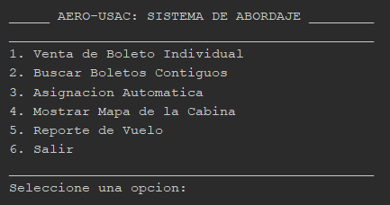
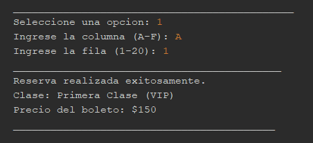
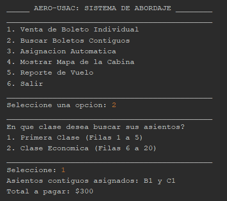
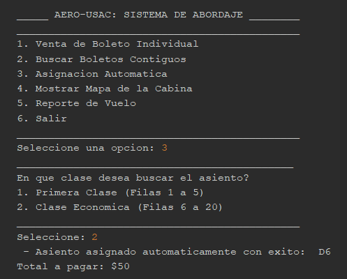
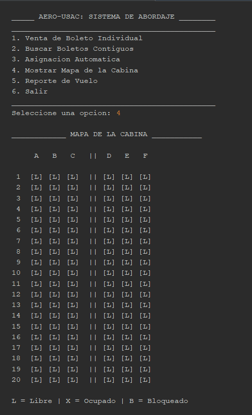
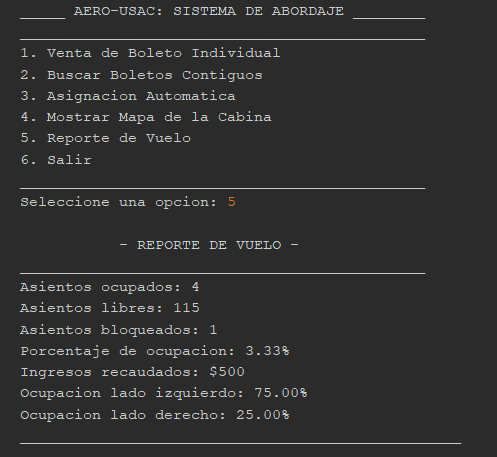
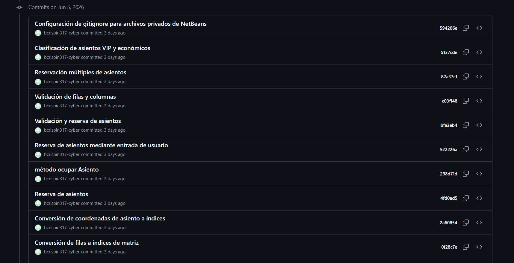
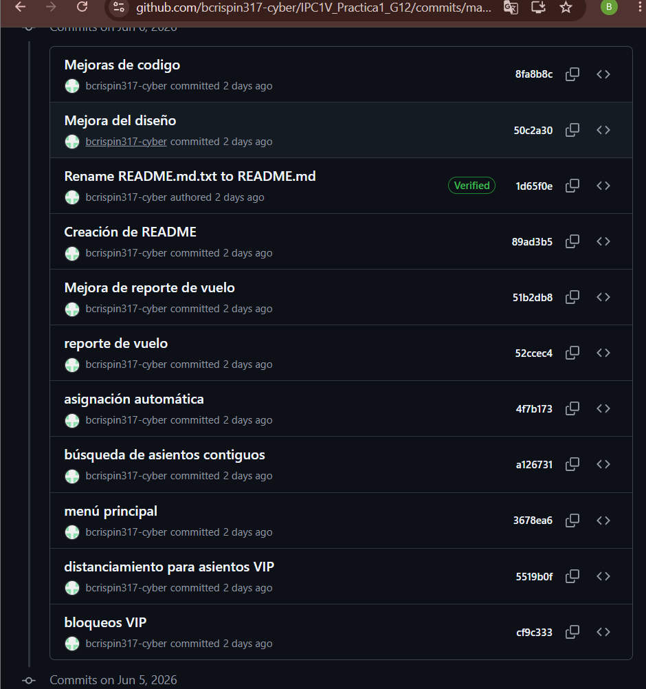
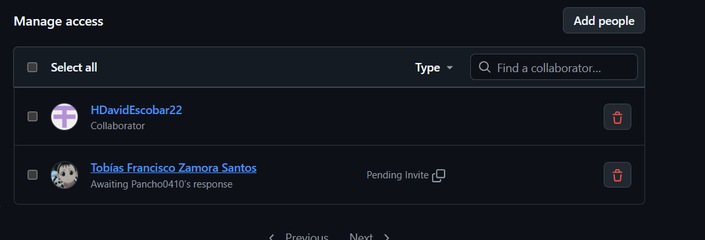

# Sistema de Asignación de Asientos - AERO-USAC

## Información Académica

**Universidad de San Carlos de Guatemala**
**Facultad de Ingeniería**
**Escuela de Ciencias y Sistemas**
**Curso:** Introducción a la Programación y Computación 1
**Laboratorio:** Introducción a la Programación y Computación 1
**Práctica:** Práctica 1
**Grupo:** 12

### Integrantes

* Byron Alexander Crispin Guzmán - 202300951
* Heraldo David Escobar Rosales - 202211057

---

## Descripción

AERO-USAC es un sistema desarrollado en Java que permite administrar la asignación de asientos dentro de una aeronave comercial. La aplicación utiliza matrices bidimensionales para representar la cabina del avión y gestionar la disponibilidad de los asientos.

El sistema fue desarrollado como parte de la Práctica 1 del curso Introducción a la Programación y Computación 1 de la Universidad de San Carlos de Guatemala.

La cabina está formada por 20 filas y 6 columnas (A-F), separadas por un pasillo central, para un total de 120 asientos disponibles.

---

## Funcionalidades Implementadas

### Venta de Boleto Individual

Permite reservar un asiento indicando la fila y la columna deseada. El sistema valida que el asiento exista y que se encuentre disponible antes de realizar la reservación.

### Búsqueda de Boletos Contiguos

Busca y localiza automáticamente dos asientos consecutivos disponibles dentro de una misma fila, respetando el pasillo central de la aeronave.

### Asignación Automática

Asigna un asiento libre de forma automática considerando el balance de ocupación entre ambos lados de la cabina para mantener una distribución equilibrada de pasajeros.

### Zona VIP

Las filas 1 a 5 corresponden a Primera Clase. Cuando un asiento VIP es reservado, los asientos adyacentes pueden bloquearse automáticamente para proporcionar mayor comodidad y privacidad.

### Mapa de la Cabina

Permite visualizar en tiempo real el estado actual de todos los asientos de la aeronave.

### Reporte de Vuelo

Genera estadísticas relacionadas con:

* Asientos ocupados.
* Asientos libres.
* Asientos bloqueados.
* Ingresos recaudados.
* Porcentaje de ocupación.
* Ocupación por lado de la cabina.

---

## Distribución de la Cabina

```text
A B C || D E F
```

Donde:

* A, B y C corresponden al lado izquierdo.
* D, E y F corresponden al lado derecho.
* El símbolo `||` representa el pasillo central.

---

## Estructura de la Matriz

```java
char[][] cabina = new char[20][6];
```

Estados de los asientos:

| Estado | Descripción       |
| ------ | ----------------- |
| L      | Asiento Libre     |
| X      | Asiento Ocupado   |
| B      | Asiento Bloqueado |

---

## Tecnologías Utilizadas

* Java
* Apache NetBeans
* Git
* GitHub

---

## Historial de Funcionalidades

* Inicialización de la cabina.
* Visualización de la cabina.
* Reserva de asientos.
* Validación de filas y columnas.
* Clasificación VIP y Económica.
* Bloqueo automático de asientos VIP.
* Búsqueda de boletos contiguos.
* Asignación automática de asientos.
* Generación de reportes de vuelo.
* Documentación mediante README.md.

---

## Ejecución

1. Clonar o descargar el repositorio.
2. Abrir el proyecto en Apache NetBeans.
3. Compilar el proyecto.
4. Ejecutar la clase principal.
5. Utilizar el menú principal del sistema.

---

## Capturas del Sistema

### Menú Principal



### Venta de Boleto Individual



### Venta de Boletos Contiguos



### Asignación Automática



### Mapa de la Cabina



### Reporte de Vuelo



---

## Fragmentos Relevantes del Código

### Declaración de la Matriz

La cabina se representa mediante una matriz bidimensional de caracteres:

```java
char[][] cabina = new char[20][6];
```

Esta estructura permite almacenar y administrar los 120 asientos de la aeronave.

---

### Método para Mostrar la Cabina

La visualización de la cabina se realiza recorriendo completamente la matriz:

```java
for (int fila = 0; fila < 20; fila++) {
    for (int columna = 0; columna < 6; columna++) {
        System.out.print(cabina[fila][columna] + " ");
    }
    System.out.println();
}
```

Este recorrido permite mostrar el estado actual de cada asiento.

---

### Validación de Asientos

Antes de reservar un asiento, el sistema verifica que se encuentre disponible:

```java
if (cabina[fila][columna] != 'L') {
    System.out.println("El asiento seleccionado no está disponible.");
    return;
}
```

Esta validación evita reservaciones duplicadas.

---

### Lógica de la Zona VIP

Las filas VIP poseen reglas especiales para bloquear asientos cercanos y proporcionar mayor comodidad:

```java
if (esVIP(numeroFila)) {

    cabina[fila][columna] = 'X';

    if (fila > 0) {
        cabina[fila - 1][columna] = 'B';
    }

    if (fila < 19) {
        cabina[fila + 1][columna] = 'B';
    }
}
```

---

### Cálculo del Reporte

El porcentaje de ocupación se calcula mediante la siguiente operación:

```java
double porcentajeOcupacion =
        (ocupados * 100.0) / 120;
```

Con esta información el sistema genera estadísticas de ocupación e ingresos.

---

## Control de Versiones

El proyecto fue desarrollado utilizando Git y GitHub para facilitar el control de versiones, el seguimiento de cambios y el trabajo colaborativo entre los integrantes del grupo.

Durante el desarrollo se realizaron múltiples commits para registrar avances, correcciones y mejoras implementadas en cada etapa del proyecto.


---

## Evidencia de Commits y Trabajo Colaborativo

Durante el desarrollo del proyecto se utilizó Git y GitHub para registrar los avances realizados por los integrantes del grupo. Cada cambio importante fue almacenado mediante commits, permitiendo mantener un historial detallado de modificaciones y facilitar el trabajo colaborativo.

A continuación se presentan capturas de pantalla que evidencian los commits realizados durante el desarrollo del proyecto.

### Historial de Commits



### Commits Realizados por los Integrantes




### Evidencia de Colaboración en GitHub



Las imágenes anteriores muestran la participación de los integrantes dentro del repositorio y el uso adecuado de herramientas de control de versiones durante el desarrollo de la práctica.

---

## Repositorio

Repositorio oficial del proyecto:

https://github.com/bcrispin317-cyber/IPC1V_Practica1_G12


